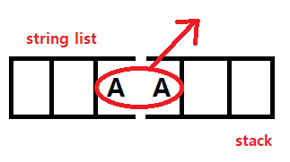

## BOJ 1406. 에디터

### 문제 링크

[[BOJ 1406] 에디터](https://www.acmicpc.net/problem/1406)

### 분류

자료구조, 스택, 연결 리스트

### 개념 설명



### 코드

``` python
from collections import deque
import sys

# 커서를 기준으로 리스트와 덱을 분할
text = list(sys.stdin.readline().strip())
commandline = int(sys.stdin.readline().strip())
text_right = deque([])

# 리스트의 top, 덱의 bottom 의 pop, append 로 커서 구현
for i in range(commandline):
    command = sys.stdin.readline().strip()
    if command.startswith('L')== True :
        try :
            letter = text.pop()
            text_right.appendleft(letter)
        except :
            continue

    elif command.startswith('D') == True :
        try :
            letter = text_right.popleft()
            text.append(letter)
        except :
            continue

    elif command.startswith('B') == True :
        try :
            text.pop()
        except :
            continue

    elif command.startswith('P')== True :
        text.append(command.lstrip('P '))

# 출력은 덱과 리스트를 이은 뒤 string화
print(''.join(text + list(text_right)))
```

