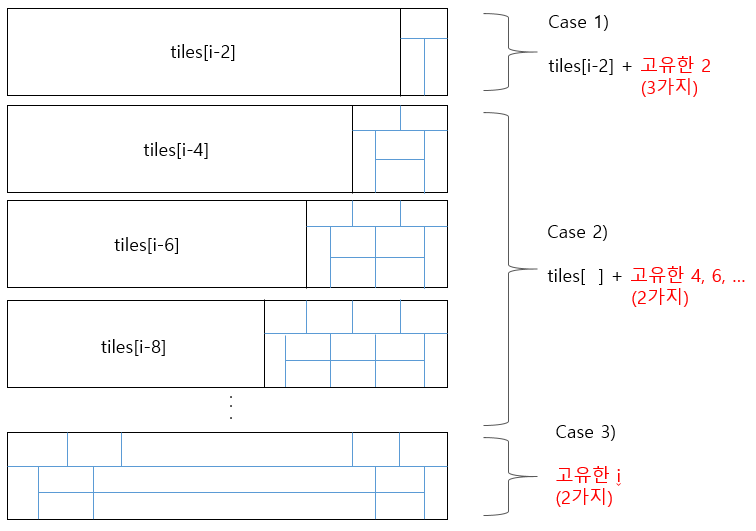

## BOJ 2133. 타일 채우기

### 문제 링크

[[BOJ 2133\] 타일 채우기](https://www.acmicpc.net/problem/2133)

### 분류

다이나믹 프로그래밍

### 다이나믹 프로그래밍(DP)

#### 1. 초기값 설정

```
N = int(input())

# 경우의 수를 넣어줄 리스트 생성
# N번째 인덱스에 저장된 값이 결과값
tiles = [0] * 31

# DP를 위한 초기값 설정
tiles[2] = 3
tiles[4] = 11    # 9 + 2(고유한 4)
```

- 주의사항: `tiles = [0] * (N+1)` 로 설정하면, 입력된 N이 4보다 작을 때 초기 값 넣어주는 과정에서 오류 났음.

#### 2. DP 함수 아이디어

[](https://github.com/kimsj-git/home/blob/master/1110_study/220820/assets/boj_2133_image.png)

### 코드

```python
def tiles_dp(n):
    if n < 6:
        return tiles[n]
    for i in range(6, n+1, 2):
        # Case 1: 고유한 2
        tiles[i] += tiles[i-2] * 3 
        
        # Case 2: 고유한 4, 6, 8, ..., i-4 (2와 i 제외)
        for j in range(2, i-2, 2):
            tiles[i] += tiles[j] * 2
        
        # Case 3: 고유한 i
        tiles[i] += 2
        
    return tiles[n]
```

