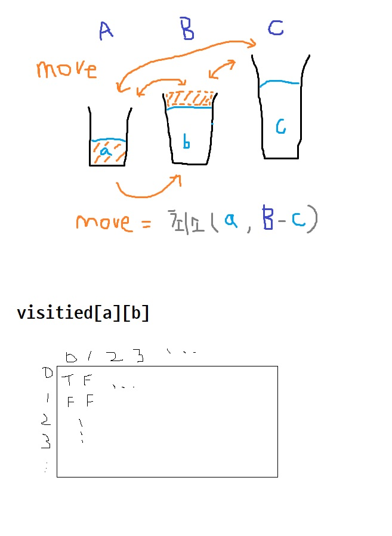

## BOJ 2251. 물통

### 문제 링크

[[BOJ 2251\] 물통](https://www.acmicpc.net/problem/2251)

### 분류

그래프 이론, 그래프 탐색, BFS, DFS

## 아이디어



### 코드

```python
from collections import deque

'''
각 물통에 담긴 물의 양을 a, b, c로 정의한다.
물의 총량은 일정하므로 a, b 값에 따라 c 값은 결정된다.
모든 가능한 a, b 조합을 BFS 탐색하면서, a가 0일 때 c의 값을 저장한다.
'''

A, B, C = map(int, input().split())

visited = [[False] * (B+1) for _ in range(A+1)]
# visited[a][b]: a, b 값 방문 여부 체크

c_values = set()   # a == 0일때 c의 값 저장, 중복 제거 위해 set

queue = deque()

# 최초 [a, b] 값인 [0, 0]을 큐에 추가
queue.append([0, 0])
visited[0][0] = True

# 최초 c 값을 저장
c_values.add(C)

# BFS 탐색
while queue:
    a, b = queue.popleft()  # A, B 물통에 각각 채워진 양
    c = C - a - b           # C 물통에 채워진 양
    
    # A가 비어 있을 때 C에 채워진 물 양 추가
    if a == 0:
        c_values.add(c)
    
    # 1) A -> B 이동
    # 이동하는 물의 양은 A에 채워진 양(a)과 B의 빈 양(B-b) 중 최소값
    move = min(a, B - b)
    na = a - move
    nb = b + move
    if not visited[na][nb]:
        queue.append([na, nb])
        visited[na][nb] = True
    
    # 2) A -> C 이동
    # 이동하는 물의 양은 A에 채워진 양(a)과 C의 빈 양(C-c) 중 최소값
    move = min(a, C - c)
    na = a - move
    nb = b
    if not visited[na][nb]:
        queue.append([na, nb])
        visited[na][nb] = True
    
    # 3) B -> A 이동
    # 이동하는 물의 양은 B에 채워진 양(b)과 A의 빈 양(A-a) 중 최소값
    move = min(b, A - a)
    na = a + move
    nb = b - move
    if not visited[na][nb]:
        queue.append([na, nb])
        visited[na][nb] = True
    
    # 4) B -> C 이동
    # 이동하는 물의 양은 B에 채워진 양(b)과 C의 빈 양(C-c) 중 최소값
    move = min(b, C - c)
    na = a
    nb = b - move
    if not visited[na][nb]:
        queue.append([na, nb])
        visited[na][nb] = True

    # 5) C -> A 이동
    # 이동하는 물의 양은 C에 채워진 양(c)과 A의 빈 양(A-a) 중 최소값
    move = min(c, A - a)
    na = a + move
    nb = b
    if not visited[na][nb]:
        queue.append([na, nb])
        visited[na][nb] = True
    
    # 6) C -> B 이동
    # 이동하는 물의 양은 C에 채워진 양(c)과 B의 빈 양(B-b) 중 최소값
    move = min(c, B - b)
    na = a
    nb = b + move
    if not visited[na][nb]:
        queue.append([na, nb])
        visited[na][nb] = True
    
result = sorted(list(c_values))
print(*result)
```

